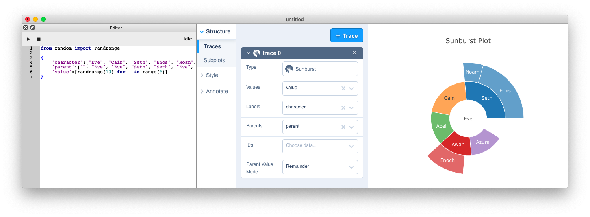

## PyChart - a python based chart design tool

PyChart integrates a python editor for data generation and the Plotly react-chart-editor for chart layout design into a Qt based application.

Download the [Release v0.1.0 for macOS](https://github.com/bwarne/pychart/releases/download/v0.1.0/PyChart-0.1.0.dmg)
